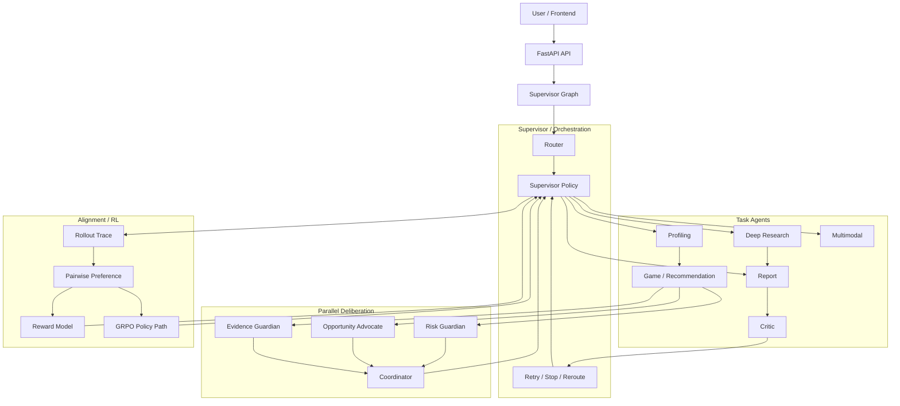

# GaokaoAgent

GaokaoAgent is a research prototype for Gaokao preference planning. It treats college-application planning as a high-risk, long-horizon, constraint-heavy decision problem rather than a single-turn chatbot task.

The current system is best described as a graph-orchestrated multi-agent decision system. LangGraph provides the executable graph, a centralized supervisor controls routing and retry decisions, task agents handle profiling/recommendation/research/reporting/critique, and the alignment pipeline explores how learned policies can assist supervisor-level orchestration.

This repository is not a production-ready admissions product. The main decision path is runnable and useful for demos or research discussion, but full production use would still require broader benchmarks, monitoring, stronger source reliability checks, and real-user feedback loops.

## Current Positioning

The project has three main lines:

1. Structured recommendation and risk control
   - Build a candidate slate from historical admissions data, yearly enrollment plans, and score-rank tables.
   - Estimate admission risk with probability modeling, Monte Carlo simulation, and rush/target/safe grouping.
   - Generate an explainable report instead of asking an LLM to invent a school list directly.

2. Graph-orchestrated multi-agent workflow
   - Use a supervisor graph to route between profiling, recommendation, deep research, report generation, critic review, and fallback paths.
   - Add explicit agent messages, local memories, and a parallel deliberation layer after candidate generation.
   - Keep the architecture centralized and auditable rather than fully autonomous.

3. Orchestration-level alignment and RL exploration
   - Model supervisor decisions such as whether to search, deepen research, reflect, reroute, or stop.
   - Build rollout traces, pairwise preferences, proxy rewards, reward-model hooks, and GRPO-compatible training data.
   - Treat learned policies as optional rerankers/hooks; the default runtime remains heuristic-first until stronger evaluation supports broader use.

## Architecture



For a deeper architecture explanation, read [docs/project_architecture_guide.md](docs/project_architecture_guide.md).
For experiment commands and 2025 backtest usage, read [docs/experiment_runbook.md](docs/experiment_runbook.md).

## Main Runtime Path

The standard recommendation path is:

1. `router_agent` classifies the user request.
2. `profiling_agent` extracts score, rank, subject group, preference, and risk constraints.
3. `game_agent` builds candidate school-major groups from structured admissions data.
4. parallel advisor agents review the candidate slate from risk, opportunity, and evidence perspectives.
5. `deliberation_coordinator` aggregates the advisor votes.
6. the supervisor decides whether to report, deepen research, reroute, or stop.
7. `report_agent` generates a structured recommendation report.
8. `critic_agent` checks risk, consistency, and fallback requirements.

## Data Assets

The current recommendation path uses:

- 2021-2024 historical admissions records: 30,301 rows.
- 2025 enrollment-plan data.
- 2021-2025 score-rank tables.
- school-major group metadata and subject constraints.
- optional search/RAG data for deep research and rule checks.

These assets make the system closer to a constrained slate recommendation prototype than to a pure LLM generation demo.

## Alignment / RL Pipeline

The alignment work focuses on supervisor orchestration rather than direct school-list generation.

Implemented pipeline pieces include:

- synthetic case generation
- supervisor rollout tracing
- pairwise preference construction
- SFT / preference / GRPO dataset export
- lightweight supervisor action ranker
- reward-model training scripts
- GRPO training scripts
- runtime hooks for learned ranker, LLM supervisor, and reward-model reranking
- offline evaluation scripts

Important caveat: current evaluation logs are small-sample sanity checks. They prove that the training/evaluation path runs end to end; they should not be cited as stable online-gain evidence.

For reproduction commands, read [backend/docs/orchestration_alignment_training.md](backend/docs/orchestration_alignment_training.md).

## Quick Start

### Requirements

- Python 3.11+
- Node.js 18+
- uv
- one LLM provider:
  - local Ollama, for example `qwen2.5:7b`
  - or a cloud Qwen-compatible API key

### Backend

```powershell
cd backend
copy .env.example .env
uv sync
uv run uvicorn src.main:app --reload --port 8000
```

The backend runs at `http://localhost:8000`.

### Frontend

```powershell
cd frontend
npm install
npm run dev
```

The frontend runs at `http://localhost:5173`.

See [docs/ROUTE_A_FASTAPI.md](docs/ROUTE_A_FASTAPI.md) for the currently supported FastAPI entrypoint.

## Tests

Run the stable backend smoke checks through the unified CLI:

```powershell
backend\.venv\Scripts\python.exe backend\scripts\gaokao_agent.py smoke --fail-fast
```

You can still run backend tests directly from the backend directory:

```powershell
cd backend
python -m pytest src
```

Useful test references:

- `backend/src/test_supervisor_policy_smoke.py`
- `backend/src/test_multi_agent_deliberation_smoke.py`
- `backend/src/test_agent_protocol_smoke.py`
- `backend/src/test_orchestration_alignment_smoke.py`
- `backend/src/test_orchestration_evaluation_smoke.py`
- `backend/tests/TESTING_GUIDE.md`

## Documentation Map

Current facts and architecture:

- [Current Project Status](docs/current_project_status_overview.md)
- [Architecture Guide](docs/project_architecture_guide.md)
- [Route A FastAPI Entry](docs/ROUTE_A_FASTAPI.md)

Interview and resume preparation:

- [Interview Final Review Pack](docs/interview_answer_memory_cards.md)

Historical evidence archive:

- [Reports Index](00_REPORTS_INDEX.md)
- [Reports Archive](docs/reports_archive/)

## What To Claim Carefully

Safe claims:

- The main graph and structured recommendation path are implemented.
- The project includes explicit multi-agent communication, local memory, and parallel deliberation.
- The alignment pipeline for supervisor orchestration is wired end to end.
- Learned policies can be attached as controlled runtime hooks.

Claims to avoid:

- Do not claim fully autonomous or decentralized multi-agent behavior.
- Do not claim stable GRPO online gains.
- Do not claim the reward is a true business reward.
- Do not call the system production-ready without the missing benchmark, monitoring, and feedback infrastructure.

## Development Status

Current state: runnable research prototype.

Completed:

- FastAPI backend entrypoint.
- React frontend for request input, progress display, recommendation matrix, and report rendering.
- structured recommendation path with admissions data.
- deep research path with search/fallback behavior.
- parallel deliberation layer.
- supervisor policy hooks and orchestration alignment scripts.

Still incomplete:

- large-scale benchmark and regression suite.
- stronger learned-policy gain verification.
- production monitoring and safety rails.
- source reliability ranking for deep research.
- broader province/rule generalization.

Last updated: 2026-04-27

## License

This project is released under the Apache License 2.0. See [LICENSE](LICENSE).

