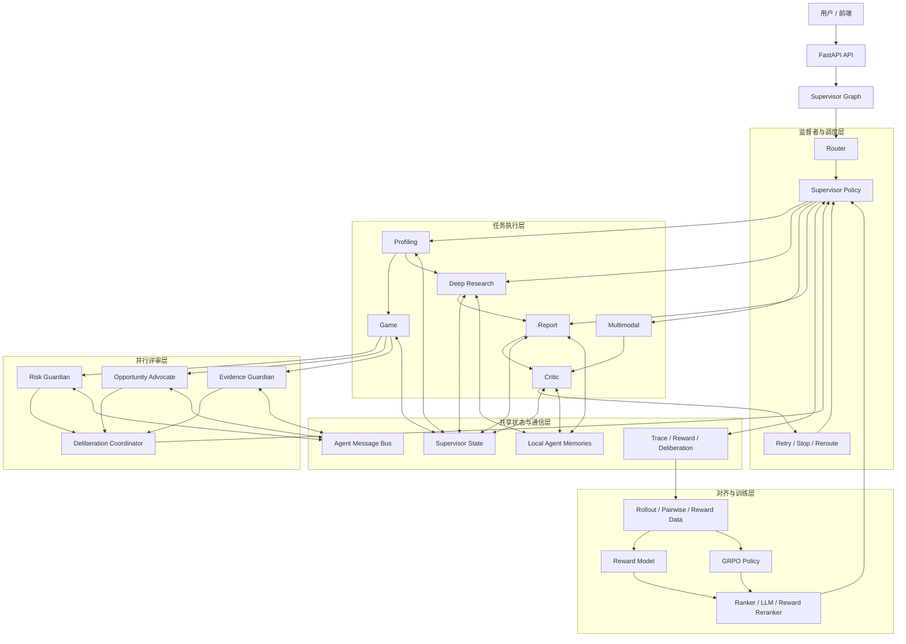

# GaokaoAgent 当前项目状态总览

本文档用于快速说明当前主线架构、模块完成度和下一步完善方向。它适合用于项目复盘、面试准备和申请材料补充说明。

## 1. 当前定位

当前项目更准确的定位是：

- 图编排的多智能体决策系统
- 面向高考志愿规划这一高风险、长路径、多约束场景
- 已具备主决策链、多智能体消息协议、并行评审、对齐数据流水线和在线策略接管接口

它已经不是单纯的问答系统或推荐网站，但也还不是完全收口的稳定产品。当前最准确的判断是：**可运行的研究型原型**。

## 2. 当前总览图

## 3. 模块完成度表

| 模块 | 当前完成度 | 当前状态 | 已完成内容 | 主要缺口 |
| --- | --- | --- | --- | --- |
| 主决策链 | 80% | 主线已成型 | Supervisor Graph、画像、候选生成、并行评审、报告、审查回退、在线策略接管接口 | 端到端鲁棒性、更多真实 case 回归 |
| 多智能体协议 | 80% | 可讲可演示 | 显式消息协议、局部记忆、deliberation summary、推荐动作聚合 | 更细粒度的 agent 间协商和并行搜索 |
| 对齐 / RL 管线 | 70% | 已打通闭环 | rollout、pairwise、reward data、TRL 脚本、HF Jobs 入口、在线 ranker/LLM/reward reranker 接口 | 更系统的训练评测、真实分布数据、稳定收益对比 |
| 深度调研分支 | 70% | 可运行但仍偏研究型 | Plan-Execute-Reflect 子图、外部检索接入、无检索时 fallback、研究型报告出口 | 检索稳定性、信息可信度评估、更强的结果融合 |
| 多模态分支 | 35% | 非主线 | 架构和解析入口已在图中 | 依赖、数据和可靠性都未完全收口 |
| 测试 / 评测 | 60% | 有 smoke test | 主决策链、协议层、对齐导出、评测脚本 smoke test | 缺完整 benchmark 和回归套件 |
| 前端展示 | 75% | 可展示主要结果 | 表单、进度、矩阵和报告展示 | 更强的调试视图与策略可视化 |

## 4. 三条主线目前做到哪里

### 4.1 主决策链

当前已经实现：

- `router -> profiling -> game -> 并行顾问 -> coordinator -> report -> critic`
- supervisor 统一管理 reroute、retry 和 stop
- `game` 之后不再直接出报告，而是先经过三路顾问评审
- 在线策略层已支持：
  - 启发式基线
  - 轻量 learned ranker
  - learned LLM supervisor
  - reward model reranker

这部分已经足够支撑“多智能体长路径决策系统”的讲法。

### 4.2 对齐 / RL 管线

当前已经实现：

- synthetic case generator
- rollout trace 记录
- pairwise preference 构造
- SFT / preference / GRPO 数据导出
- TRL reward model 训练脚本
- 本地最小 reward model 训练脚本
- TRL GRPO 训练脚本
- Hugging Face Jobs 可提交脚本
- 在线策略接管接口
- 统一评测脚本

现在缺的不是“有没有训练入口”，而是“训练完之后能否稳定优于基线，以及如何做系统级评测”。

### 4.3 深度调研分支

当前已经实现：

- 研究主题拆解
- 执行检索或 fallback 证据收集
- 反思是否足够
- 最终综合成研究报告
- 当缺少量化矩阵时，报告节点支持 research-only 输出

这一分支已能闭环，但仍依赖：

- 外部检索可用性
- 模型的结构化输出稳定性
- 更严格的信息可信度判定

## 5. 当前最值得继续补的三件事

### 5.1 主决策链

- 增加更多真实边界 case 的回归测试
- 让 critic 的回退建议更细粒度，不只是 reroute 到大模块
- 补 supervisor 层的在线观测指标和可视化

### 5.2 对齐 / RL 管线

- 建立统一 benchmark
- 补基线对比：启发式 vs ranker vs LLM supervisor vs reward reranker
- 用真实或半真实 case 分布替换纯 synthetic warm start

### 5.3 深度调研分支

- 引入来源可信度分层
- 增加对官方来源和非官方来源的显式区分
- 对检索不足的 case 给出更明确的“不能自动决策”提示

## 6. 一句话结论

目前项目已经完成了主决策链、多智能体协议、并行评审和面向监督者调度的对齐训练闭环，属于**可运行的研究型原型**。主功能已经成型，最需要继续加强的是：**系统级评测、深度调研稳定性，以及 learned policy 的真实收益验证**。
