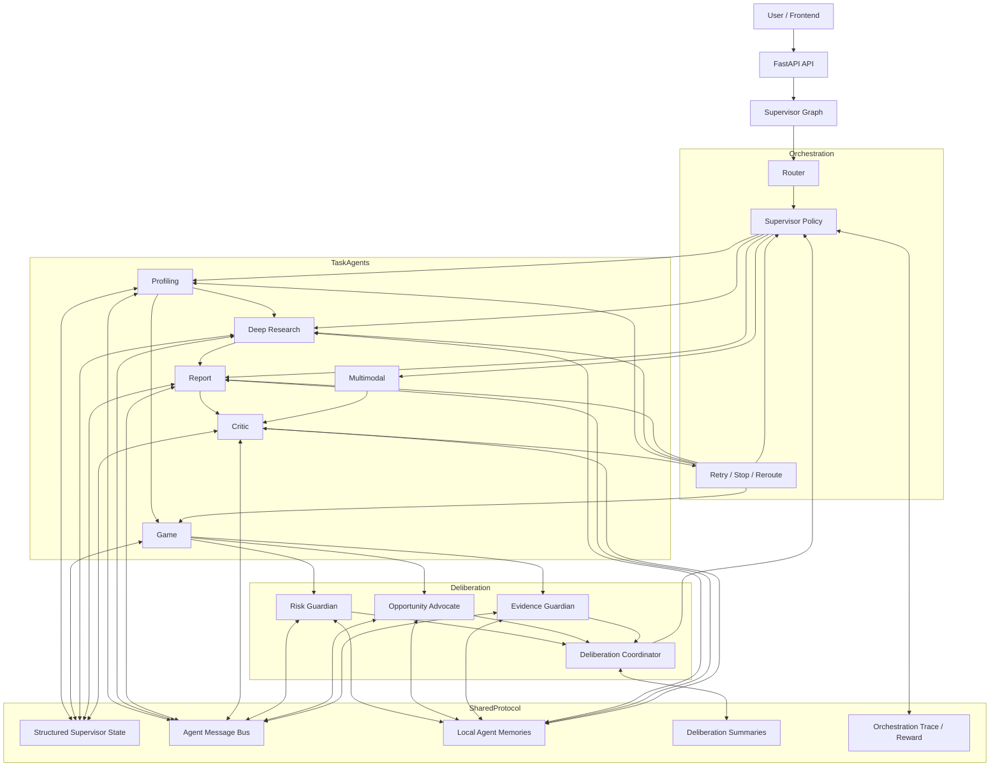

# GaokaoAgent Architecture Guide

This document explains the current mainline architecture of the project, the online inference graph, the multi-agent communication protocol, and the alignment training pipeline.

## 1. Project Positioning

The project is no longer best described as a plain recommendation website. Its current mainline is:

- a graph-orchestrated multi-agent decision system
- for long-horizon, high-risk preference planning
- with explicit inter-agent communication, local memories, deliberation, and alignment data collection

The system targets Gaokao preference planning, where the task is not single-step ranking but multi-stage decision-making under uncertainty.

## 2. Repository Reading Map

### Mainline runtime

- Backend API entry: `backend/src/main.py`
- Supervisor graph: `backend/src/graph/dual_loop_supervisor.py`
- Shared state: `backend/src/models/state.py`
- Supervisor policy: `backend/src/rl/supervisor_policy.py`

### Task agents

- Router: `backend/src/agents/router_agent.py`
- Profiling: `backend/src/agents/profiling_agent.py`
- Game / recommendation: `backend/src/agents/game_agent.py`
- Deep research: `backend/src/agents/deep_research_agent.py`
- Report: `backend/src/agents/report_agent.py`
- Critic: `backend/src/agents/critic_agent_enhanced.py`
- Multimodal: `backend/src/agents/multimodal_agent.py`

### Deliberation layer

- Parallel advisors + coordinator: `backend/src/agents/deliberation_agents.py`
- Communication bus: `backend/src/utils/agent_bus.py`
- Communication models: `backend/src/models/agent_communication.py`

### Alignment / RL pipeline

- Unified CLI and experiment runbook: `backend/src/gaokao_agent_cli.py`, `backend/scripts/gaokao_agent.py`, `docs/experiment_runbook.md`
- Rollout + pairwise generation: `backend/src/rl/orchestration_data_pipeline.py`
- Lightweight learned supervisor ranker: `backend/src/rl/orchestration_alignment.py`
- TRL utility functions: `backend/src/rl/orchestration_trl_utils.py`
- Reward model training: `backend/scripts/train_orchestration_reward_model.py`
- GRPO training: `backend/scripts/train_orchestration_grpo.py`
- HF Jobs-ready GRPO training: `backend/scripts/train_orchestration_grpo_hf_job.py`

## 3. Online System Architecture

### 3.1 Layered View



### 3.2 Core runtime path

The standard fast-loop path is:

1. `router_agent` classifies intent and loop requirements.
2. `profiling_agent` extracts structured user constraints.
3. `game_agent` generates candidate school-major groups and recommendation structure.
4. three advisor agents review the candidate slate in parallel:
   - `risk_guardian_agent`
   - `opportunity_advocate_agent`
   - `evidence_guardian_agent`
5. `deliberation_coordinator` aggregates votes into a shared recommendation.
6. `supervisor_after_game` chooses `report_agent` or `deep_research`.
7. `report_agent` generates explanation and report draft.
8. `critic_agent` audits quality, risk, and reroute requirements.
9. the supervisor either terminates or reroutes the graph.

### 3.2.1 LLM Responsibility Boundary

The system now uses LLMs in three explicit places without letting them replace
the deterministic recommender:

- `profiling_agent` extracts both hard constraints and behavioral signals:
  `stated_misconceptions`, `emotional_concerns`, `family_pressure_points`,
  `preference_assumptions`, `preference_confidence`, `major_cognition_risk`,
  and `regret_sensitivity`.
- `RiskGuardian`, `OpportunityAdvocate`, and `EvidenceGuardian` first compute a
  deterministic evidence packet, then can run an optional structured LLM vote
  over that evidence when `ENABLE_LLM_ADVISORS=1`.
- `critic_agent` keeps deterministic hard checks, then can run an optional LLM
  report audit when `ENABLE_LLM_CRITIC=1` to catch missing warnings,
  hallucinated claims, mixed-major-group risks, and weak evidence coverage.

The design rule is: code computes probabilities, risk signals, first-hit
structure, and backtestable labels; LLMs parse ambiguous human intent, critique
evidence, and explain or audit the final decision.

### 3.3 Core Recommendation Harness

The recommendation core now treats a row as a Guangdong parallel-volunteer major group, not as a plain school item. The key design is to make the painful human questions computable:

- Will this row become the first admitted result, or will it be shadowed by earlier rows?
- Is the group selling one attractive major while hiding low-fit tail majors?
- Is a small quota a real leak opportunity or just high variance?
- Is a large quota useful as a stable anchor?
- Are many families likely to chase the same obvious school/major/city signal?
- At this rank band, should the user pay more attention to platform, major fit, city, safety, or upside?

The implementation path is:

```text
UserProfile
-> candidate major groups
-> admission probability / rank risk
-> major bundle risk
-> quota stability and variance opportunity
-> score-band tradeoff policy
-> portfolio rerank / volunteer plan
-> advisor deliberation
-> report / critic
```

The score-band and market-behavior policy lives in `backend/src/recommendation/tradeoff_policy.py`. It writes auditable fields into both `MajorGroupRow` and `VolunteerChoice`:

- `score_band`
- `tradeoff_breakdown`
- `pain_point_flags`
- `market_behavior_notes`
- `tradeoff_summary`

This is where the project now encodes the earlier domain ideas instead of leaving them as interview talking points:

| Domain idea | Current implementation signal |
| --- | --- |
| Different rank bands need different tradeoffs | `ScoreBandPolicy` changes school / major / city / admission / safety / upside weights by rank |
| Parallel-volunteer game and herding | `crowding_risk` and `herding_crowding` |
| Small quotas create leak opportunity and sliding risk | `quota_bucket`, `variance_opportunity_score`, `small_quota_lottery`, `high_variance_opportunity` |
| Large quotas are more stable anchors | `quota_stability_score`, `large_quota_anchor` |
| Mixed major groups can mislead users | `major_utility_dispersion`, `tail_major_regret`, `bait_major_group` |
| Users fear sliding, wasted score, and being assigned to unwanted majors | `pain_point_flags` |
| Report should explain why, not just list probabilities | `report_agent` injects tradeoff payload into the structured prompt and fallback output |
| Advisors should not be decorative agents | `RiskGuardian`, `OpportunityAdvocate`, and `EvidenceGuardian` consume these signals before voting |

The practical interpretation is: the deterministic recommender computes the decision evidence, and the multi-agent layer challenges the evidence from three roles. This keeps the project agentic without turning the core recommender into an untraceable prompt-only workflow.

### 3.4 Prospective 2025 Backtest Layer

The next evaluation layer has been scaffolded under `backend/src/evaluation/`. It treats 2025 actual admission results as post-hoc labels, not as recommendation-time inputs.

Current files:

- `evaluation/schemas.py`: actual outcome, per-choice outcome, plan-level result, aggregate metrics.
- `evaluation/metrics.py`: first-hit simulation, in-group major assignment resolution, tail/blacklist/wasted-score metrics.
- `evaluation/backtest_2025.py`: CSV loader with configurable column mapping and one-plan runner.
- `evaluation/baselines.py`: baseline plan builders for probability-only, safe-first, tight-rank, and no-tradeoff ablations.
- `test_backtest_2025_smoke.py`: smoke coverage for first-hit and in-group assignment judging.

The intended protocol is:

```text
Visible at recommendation time:
2021-2024 historical admission data
2025 enrollment plan
2025 score-rank table
user profile and constraints

Hidden until evaluation time:
2025 actual group admission cutoff
2025 actual in-group major admission cutoff
2025 actual in-group major code / professional number
```

The backtest judges:

- whether the plan admits at least once,
- which ordered row becomes the first actual hit,
- which in-group major and major code the user reaches under actual major cutoffs,
- whether the actual result hits preferred majors, blacklisted majors, or tail-assignment risk,
- whether the plan is too conservative and wastes rank margin.

Major code is intentionally kept as an audit key even when it does not affect
current scoring. Guangdong major groups can contain multiple concrete majors,
and names may collide or change formatting across data sources; retaining codes
such as `101` lets the backtest export exact assignment evidence and leaves a
stable join key for future major-level evaluation.

This layer is what turns the project from a runnable recommendation prototype into a measurable recommendation and risk-control harness.

## 4. Why This Is No Longer Just a Workflow

The project originally looked like a centralized workflow with named agent nodes.

The current version adds four properties that make it much closer to a real multi-agent decision system:

### 4.1 Explicit communication protocol

Shared protocol fields live in `backend/src/models/state.py`:

- `agent_messages`
- `agent_memories`
- `deliberation_summaries`
- `recommended_next_action`

Messages and memory utilities are centralized in:

- `backend/src/utils/agent_bus.py`

### 4.2 Local agent memory

Advisor agents, deep research, report, and critic all write scoped memory notes instead of only mutating shared scalar state.

This allows:

- private heuristics per agent
- failure memory
- later trajectory mining for alignment

### 4.3 Parallel deliberation

The `game_agent` no longer routes directly to report generation.

Instead:

- it publishes a proposal
- three advisors read the proposal
- each advisor votes independently
- the coordinator aggregates the votes
- the supervisor consumes the deliberation summary

This creates actual competitive review rather than a single hard-coded branch.

When `ENABLE_LLM_ADVISORS=1`, each advisor performs a second-pass structured
LLM critique over its deterministic evidence packet. The LLM is not asked to
invent a new school list; it can only choose `report_agent` or `deep_research`,
state evidence gaps, and explain whether the rule-based vote should be changed.

### 4.4 Learnable orchestration policy

The supervisor now has three levels of decision logic:

1. heuristic baseline
2. optional learned action ranker
3. optional LLM-based learned supervisor policy
4. optional reward-model reranker for final action review

The policy hook is in:

- `backend/src/rl/supervisor_policy.py`
- `backend/src/rl/reward_model_scorer.py`

Environment toggles:

- `ENABLE_LEARNED_SUPERVISOR_POLICY=1`
- `ENABLE_LLM_SUPERVISOR_POLICY=1`
- `ENABLE_REWARD_MODEL_SUPERVISOR=1`

### 4.5 Recommended agent boundary

The multi-agent layer should stay small and decision-oriented. The core recommendation computation should remain a deterministic pipeline: profile normalization, candidate recall, coarse ranking, fine ranking, first-hit volunteer-plan construction, and portfolio evaluation.

Agents should only be used where role conflict is useful:

- `RiskGuardian`: checks downside, safety anchors, first-hit tail-assignment risk, and sliding risk.
- `OpportunityAdvocate`: checks whether the plan is too conservative, wastes rank, or misses high-upside major groups.
- `EvidenceGuardian`: checks whether key-prefix choices need external evidence or deep research.
- `DeliberationCoordinator`: converts parallel votes into one structured recommendation for the supervisor.
- `SupervisorPolicy`: chooses the next action and is the only component optimized by trajectory-level RL.
- `Critic`: acts as a hard audit gate after report generation.

Deep research should be treated as a slow-loop tool invoked by the supervisor, not as another always-on recommender. In the current design, "RL" means optimizing the supervisor trajectory over these roles, not fine-tuning the base LLM or directly learning school scores.

## 5. Shared State and Communication

### 5.1 Structured state

The graph uses a unified `SupervisorState` object. This state carries:

- user profile
- recommendation slate
- research report
- audit result
- retry counters
- protocol messages
- local memories
- deliberation summaries
- orchestration traces

### 5.2 Public vs. private signals

The system distinguishes:

- public protocol messages: visible to specific recipients or broadcast
- local memories: private notes scoped to one agent

This separation matters because it lets the system support:

- explicit coordination
- per-agent reasoning traces
- later reward modeling over trajectories

### 5.3 Communication contract

Each public message is now wrapped in an explicit envelope:

- `message_id`: stable id for trace inspection
- `thread_id`: conversation thread, usually one workflow stage
- `parent_message_id`: links votes or critiques back to the triggering proposal
- `sender` / `recipients`: controls visibility
- `message_type`: task, proposal, vote, critique, summary, or failure
- `priority` / `status` / `requires_ack`: supports blocking and acknowledgement
- `confidence`, `references`, `metadata`: keeps decisions auditable

For `post_game_deliberation`, the contract is:

1. `game_agent` publishes one proposal to all advisors and the coordinator.
2. `RiskGuardian`, `OpportunityAdvocate`, and `EvidenceGuardian` each publish one vote.
3. `DeliberationCoordinator` validates the required messages before aggregating.
4. If the proposal or any required vote is missing, the coordinator records `protocol_violations` and falls back to `deep_research`.
5. The supervisor consumes only the structured deliberation summary, not free-form chat.

Protocol violations are also surfaced to `SupervisorObservation` and penalized by the terminal trajectory reward through `protocol_violation_penalty`. This keeps the workflow deterministic while still allowing agentic disagreement at the right bottleneck.

## 6. Data and Tool Layer

The mainline recommendation path depends on:

- historical admissions data
- yearly enrollment plans
- score-rank tables
- Monte Carlo simulation
- probability and portfolio analysis
- optional web search / deep research tools

Core data/recommendation modules:

- `backend/src/engines/quant_engine.py`
- `backend/src/engines/probability.py`
- `backend/src/engines/monte_carlo_sim.py`
- `backend/src/rl/runtime_policy.py`

## 7. Alignment and RL Pipeline

### 7.1 Data generation

The current alignment path is:

```text
synthetic cases
  -> supervisor rollouts
  -> orchestration traces
  -> pairwise preferences
  -> SFT / preference / GRPO datasets
```

Main files:

- `backend/src/rl/orchestration_data_pipeline.py`
- `backend/src/rl/orchestration_alignment.py`
- `backend/src/rl/orchestration_trl_utils.py`

### 7.2 What is being optimized

The current RLHF / GRPO direction is not “learning the rush-target-safe ratio directly”.

Instead, it focuses on:

- routing decisions
- whether to continue research
- whether to trigger deeper verification
- whether to enter critic / reflection loops
- when to stop

This is more appropriate because the orchestration problem is a long-horizon sequential decision problem.

### 7.3 Training stages

There are now three training paths:

1. lightweight action ranker
   - cheap
   - directly deployable online
   - based on pairwise preferences

2. reward model
   - trained from chosen/rejected action preferences
   - implemented with TRL `RewardTrainer`

3. GRPO policy model
   - trained on orchestration tasks and reward functions
   - implemented with TRL `GRPOTrainer`
   - supports optional reward model integration

Relevant scripts:

- `backend/scripts/train_supervisor_action_ranker.py`
- `backend/scripts/train_orchestration_reward_model.py`
- `backend/scripts/train_orchestration_grpo.py`
- `backend/scripts/train_orchestration_grpo_hf_job.py`
- `backend/scripts/evaluate_orchestration_policies.py`

## 8. Hugging Face Jobs Path

For cloud GPU training, use:

- `backend/scripts/train_orchestration_grpo_hf_job.py`

This version is designed for Hugging Face Jobs:

- PEP 723 inline dependencies
- Hub push as first-class output
- Trackio reporting enabled
- remote dataset loading supported

## 9. Mainline vs. Legacy / Experimental Modules

### Mainline

These are the files that reflect the current architecture:

- `backend/src/main.py`
- `backend/src/graph/dual_loop_supervisor.py`
- `backend/src/models/state.py`
- `backend/src/agents/*`
- `backend/src/utils/agent_bus.py`
- `backend/src/rl/supervisor_policy.py`
- `backend/src/rl/orchestration_*`

### Legacy / exploratory RL modules

These still exist in the repo but are not the mainline orchestration story anymore:

- `backend/src/rl/prompt_rl_trainer.py`
- `backend/src/rl/grpo_recommendation_policy.py`
- `backend/src/rl/grpo_recommendation_trainer.py`
- `backend/src/rl/school_selector_trainer.py`
- `backend/src/rl/environment.py`

They remain useful as references, but the current alignment narrative should center on orchestration policy learning.

## 10. Recommended Reading Order

For a new reader:

1. `backend/src/main.py`
2. `backend/src/graph/dual_loop_supervisor.py`
3. `backend/src/models/state.py`
4. `backend/src/agents/game_agent.py`
5. `backend/src/agents/deliberation_agents.py`
6. `backend/src/agents/deep_research_agent.py`
7. `backend/src/agents/report_agent.py`
8. `backend/src/agents/critic_agent_enhanced.py`
9. `backend/src/rl/supervisor_policy.py`
10. `backend/src/rl/orchestration_data_pipeline.py`
11. `backend/src/rl/orchestration_alignment.py`
12. `backend/src/rl/orchestration_trl_utils.py`

## 11. Current Status

The project is currently in a strong research-prototype state:

- the online graph is functional
- the multi-agent protocol is explicit
- the deliberation layer is implemented
- trajectory logging and pairwise dataset generation are implemented
- lightweight learned routing is deployable
- reward model and GRPO scripts exist for the next training stage

What is still incomplete:

- no full production benchmark yet
- no large-scale online learned supervisor deployment yet
- HF Jobs submission flow is prepared but not executed from this repository automatically
- multimodal path still depends on missing environment pieces such as `PyMuPDF`

